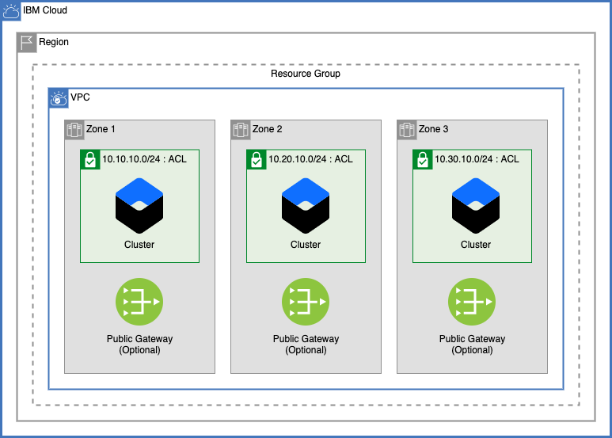

# Easy Multizone VPC IKS Cluster (Version 2)

This template allows users to easily create a VPC with one subnet in each of three zones, with an IBM Kubernetes Service Cluster distributed in each zone with very few inputs needed by the user to quickly start using IBM Cloud VPC .

## Default Configuration

The defaults of this module can be [overridden](#overriding-variables) with JSON to allow for a fully cusomizable VPC environment.

## Table of Contents

1. [Module Variables](#module-variables)
1. [VPC and Subnets](#vpc-and-subnets)
2. [Network ACL](#nettwork-access-control-list)
3. [Public Gateways](#public-gateways)
4. [Cluster](#cluster)
5. [Overriding Variables](#overriding-variables)

## Module Variables

Name                            | Type         | Description                                                                                                                                                                                                                                                                                                                                                                                                                                                                         | Sensitive | Default
------------------------------- | ------------ | ----------------------------------------------------------------------------------------------------------------------------------------------------------------------------------------------------------------------------------------------------------------------------------------------------------------------------------------------------------------------------------------------------------------------------------------------------------------------------------- | --------- | ---------------------------
TF_VERSION                      | string       | The version of the Terraform engine that's used in the Schematics workspace.                                                                                                                                                                                                                                                                                                                                                                                                        |           | 1.0
prefix                          | string       | A unique identifier for resources. Must begin with a letter. This prefix will be prepended to any resources provisioned by this template.                                                                                                                                                                                                                                                                                                                                           |           | ez-multizone-iks
region                          | string       | Region where VPC will be created. To find your VPC region, use `ibmcloud is regions` command to find available regions.                                                                                                                                                                                                                                                                                                                                                             |           | us-south
resource_group                  | string       | Name of existing resource group where all infrastructure will be provisioned                                                                                                                                                                                                                                                                                                                                                                                                        |           | asset-development
tags                            | list(string) | List of tags to apply to resources created by this module.                                                                                                                                                                                                                                                                                                                                                                                                                          |           | ["ez-vpc", "multizone-vpc"]
use_public_gateways             | bool         | Add a public gateway in each zone.                                                                                                                                                                                                                                                                                                                                                                                                                                                  |           | true
allow_inbound_traffic           | bool         | Add a rule to the ACL to allow for inbound traffic from any IP address.                                                                                                                                                                                                                                                                                                                                                                                                             |           | true
classic_access                  | bool         | Add the ability to access classic infrastructure from your VPC.                                                                                                                                                                                                                                                                                                                                                                                                                     |           | false
zones                           | number       | Number of zones for the cluster                                                                                                                                                                                                                                                                                                                                                                                                                                                     |           | 3
iks_cluster_version             | string       | IKS Cluster version. To get a list of valid versions, use the IBM Cloud CLI command `ibmcloud ks versions`. To use the default version, leave as `default`.                                                                                                                                                                                                                                                                                                                         |           | default
machine_type                    | string       | The flavor of VPC worker node to use for your cluster. Use `ibmcloud ks flavors` to find flavors for a region.                                                                                                                                                                                                                                                                                                                                                                      |           | bx2.4x16
workers_per_zone                | number       | Number of workers to provision in each subnet                                                                                                                                                                                                                                                                                                                                                                                                                                       |           | 1
disable_public_service_endpoint | bool         | Disable public service endpoint for cluster. Once the service endpoint has been enabled, it cannot be disabled after cluster creation.                                                                                                                                                                                                                                                                                                                                              |           | true
wait_till                       | string       | To avoid long wait times when you run your Terraform code, you can specify the stage when you want Terraform to mark the cluster resource creation as completed. Depending on what stage you choose, the cluster creation might not be fully completed and continues to run in the background. However, your Terraform code can continue to run without waiting for the cluster to be fully created. Supported args are `MasterNodeReady`, `OneWorkerNodeReady`, and `IngressReady` |           | IngressReady
override                        | bool         | Override default values with custom JSON template. This uses the file `override.json` to allow users to create a fully customized environment.                                                                                                                                                                                                                                                                                                                                      |           | false

## VPC and Subnets

### VPC

This module creates a single VPC in one IBM Cloud Region. The VPC can optionally be given access to Classic Infrastructure resources using the `classic_access` variable.

### Subnets

This module creates three subnets, one in each of the three zones:

Zone | Subnet CIDR
-----|-------------
1    | 10.10.10.0/24
2    | 10.20.10.0/24
3    | 10.30.10.0/24

---

## Network Access Control List

A single network ACL is created within the VPC and each of the three subnets are attached

### Network Access Control Rules

The following network rules are automatically created for the VPC:

#### Internal Allow Rules

Source        | Destination   | Direction  | Allow / Deny
--------------|---------------|------------|--------------
10.10.10.0/24 | Any           | Inbound    | Allow
10.20.10.0/24 | Any           | Inbound    | Allow
10.30.10.0/24 | Any           | Inbound    | Allow
Any           | 10.10.10.0/24 | Outbound   | Allow
Any           | 10.20.10.0/24 | Outbound   | Allow
Any           | 10.30.10.0/24 | Outbound   | Allow
Any           | Any           | Outbound   | Allow

#### Cluster Allow Rules

These rules are automatically added to allow the cluster to reach the nessecary endpoints for the creation of IBM Managed Cluster components.

Source        | Destination   | TCP Rules        | Direction  | Allow / Deny
--------------|---------------|------------------|------------|--------------
161.26.0.0/16 | Any           |                  | Inbound    | Allow
166.8.0.0/14  | Any           |                  | Inbound    | Allow
Any           | Any           | Port 30000-32767 | Inbound    | Allow
Any           | Any           | Port 443         | Inbound    | Allow
Any           | 161.26.0.0/16 |                  | Outbound   | Allow
Any           | 166.8.0.0/14  |                  | Outbound   | Allow
Any           | Any           | Port 30000-32767 | Outbound   | Allow
Any           | Any           | Port 443         | Outbound   | Allow
Any           | Any           |                  | Outbound   | Allow

### Additional Access Control Rules

- To create a rule to allow all inbound traffic to your VPC, set the `allow_inbound_traffic` variable to `true`.

---

## Public Gateways

Optionally, a public gateway can be added to each of the three subnets by setting the `use_public_gateways` variable to `true`.

---

## Cluster

This module creates a Red Hat OpenShift Cluster across all three subnets provisioned with the VPC. 

---

## Overriding Variables

This template uses a [vpc module](./ez_vpc/ez_vpc_cluster) to create the network architecture. A complete custom network architecture can be created from this template by passing stringified `json` data into the `override` variable. For an example of a valid JSON file, see [override-json.json](./override-json.json)